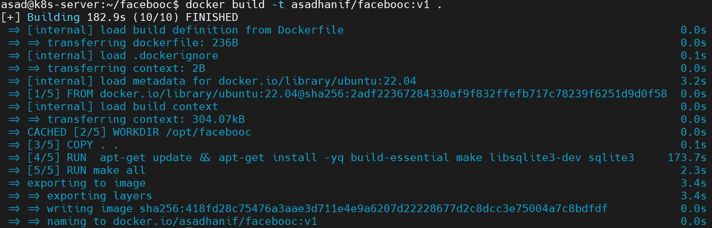

# Facebooc


The only dependency is SQLite3.

This is Proof-of-concept Facebook clone in C, part of [Facebooc](https://github.com/jserv/facebooc.git).  

### Technology Stack 
Following technology stack is being used to develop and run the application. 
 * C
 * Docker Engine

# Prerequisites

**OS: Ubuntu**

Install following  package:  

  * build-essential
  * make
  * libsqlite3-dev
  * sqlite3
  
```bash
sudo apt-get update
sudo apt-get install -yq build-essential make libsqlite3-dev sqlite3
```
**Note**: When you launch a container using **ubuntu** image from the repository, it may not have sudoers installed. Also, you would be a root user inside the container. In such case, remove sudo and execute rest of the command. 

# Build

Repository contains the source files written in C, along with a Makefile with targets such as "all", "run". Destination path should be **/opt/facebooc**.
Run the following command to compile the source code.make all

```bash
cd facebooc
make all
```

# Run 

Launch app as bin/facebooc This will attach to port **16000**


```bash
cd facebooc
bin/facebooc
```

## Steps for Execution 
 
### Step 1: Dockerfile

A Dockerfile is created with following conetents. 

```
  FROM  ubuntu:22.04
  
  WORKDIR /opt/facebooc
  
  COPY . .
  
  RUN  apt-get update && apt-get install -yq build-essential \
  make \
  libsqlite3-dev \
  sqlite3

  EXPOSE 16000

  CMD ["bin/facebooc"]
```  

### Step 2: Build Image
To execute the application, an image is built from Dockerfile using following command. 

`docker build -t asadhanif/facebooc:v1 .` 



### Step 3: Run the Container
Run the container with following command:

`docker run -dp 16000:16000 asadhanif/facebooc:v1` 


### Running App
Open the browser and brows `<ip-address>:16000`


Licensing
---------
`Facebooc` is freely redistributable under the two-clause BSD License.
Use of this source code is governed by a BSD-style license that can be found
in the `LICENSE` file.
